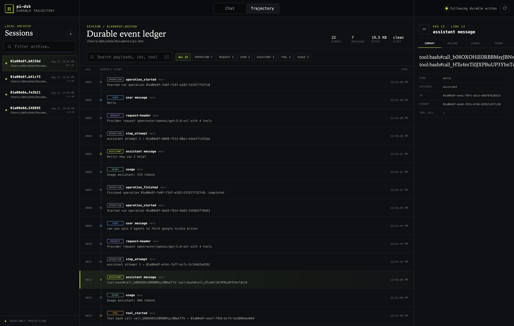

# pi-dsh

A minimal personal coding-agent harness with Pi's readable agent loop and tools on top of a
durable, event-sourced session engine. It ports selected failure semantics from DeepSeek Harness
(dsh) as executable tests without adopting Cordis or dsh's event vocabulary.



The distinguishing features are approval-gated host self-extension, causally queryable session
history, and durable constraints that survive compaction and restart.

## Status

Implemented:

- Pi loop integration with read, bash, edit, and write tools
- Pi v4 as the single session vocabulary
- append → fsync durability, rollback, atomic publication, torn-tail recovery, and writer locks
- durable tool-start checkpoints and append-only interrupted-run repair
- closed-prefix transactional compaction with provenance
- durable add/revoke constraint events
- one typed component graph with dependency activation, reversible effects, and idle replacement
- model-facing session search, event windows, direct causal traces, and session lineage
- approval-gated process-local host extensions with worker-thread preemption
- create, resume, steer, follow-up, abort, fork, compact, and subscribe APIs
- dependency-free trajectory viewer with surface filters, causal inspection, and live SSE updates

The strict typecheck and 138 local tests pass. The paid constraint-adherence benchmark and a live
provider crash smoke test are still product-validation gates; the local suite does not substitute
for them.

## Requirements

- Node.js 22.19 or newer
- npm
- an OpenRouter API key in `OPENROUTER_API_KEY`, or `openrouter_key=...` in `~/ai_keys_loop`
- an explicitly selected model in `PIDSH_MODEL`

## Install

```sh
git clone --recurse-submodules https://github.com/abhishekgahlot2/pi-dsh.git
cd pi-dsh
npm ci
```

If the repository was cloned without submodules:

```sh
git submodule update --init --recursive
```

## Test

Run the complete local verification:

```sh
npm run check
npm test
```

Expected result at this revision: 18 test files and 138 passing tests, including Pi storage
conformance, crash durability, repair races, component rollback, worker preemption, self-extension,
causal query, compaction, constraints, API lifecycle, and web/SSE coverage.

To verify that the committed Pi subset still matches the pinned upstream submodule:

```sh
npm run sync
npm run check
npm test
git diff --exit-code -- vendor/pi
```

`npm run sync` deliberately refreshes `vendor/pi/UPSTREAM.json`, including its synchronization
timestamp, so review that file before committing an upstream refresh.

## Run the agent

Create a local `.env` and select any current OpenRouter model ID:

```sh
cp .env.example .env
# Edit PIDSH_MODEL in .env.
npm start
```

`npm start` loads `.env` automatically. The API key may remain in `~/ai_keys_loop` as
`openrouter_key=...`; it does not need to be copied into the repository.

The CLI prints the session ID. Supported commands include:

```text
/constraint add <id> <instruction>
/constraint revoke <id>
/extension inspect
/extension approve <extension-id> <revision-id> <source-hash>
/extension run <extension-id> <revision-id>
/extension stop <extension-id>
/extension rollback <extension-id> <revision-id>
/extension remove <extension-id>
/compact
/quit
```

The model receives read-only history tools (`session_search`, `session_event_window`,
`session_trace`, `session_lineage`) and extension lifecycle tools (`extension_inspect`,
`extension_define`, `extension_run`, `extension_stop`, `extension_update`,
`extension_rollback`, `extension_remove`). Model lifecycle calls schedule work for the next turn;
they never mutate the active request's tool/prompt snapshot.

`extension_define` records a model-authored host function and returns after the operation's
post-run drain creates an immutable revision. Use `/extension inspect` to read its revision and
source hash, approve that exact pair, then ask the model to run it in a later turn. Extension
source is durable in assistant tool-call history. Definitions and workers are process-local and
are not restored after restart.

Resume an existing session:

```sh
PIDSH_MODEL="<model-id>" npm start -- --resume <session-id>
```

Configuration is available through `PIDSH_BASE_URL`, `PIDSH_CONTEXT_WINDOW`,
`PIDSH_MAX_TOKENS`, `PIDSH_SESSIONS_ROOT`, and `PIDSH_OPENROUTER_KEY_NAME`. The last
variable selects a named `key=value` entry from `~/ai_keys_loop` without copying the secret.
The default session directory is `.pi-dsh/sessions` under the working directory.

## Inspect trajectories

Start the read-only local viewer:

```sh
npm run web
```

Open <http://127.0.0.1:8787>. The viewer shows sessions, model-visible chat, the complete durable
event ledger, request snapshots, tool checkpoints/results, constraints, compaction, repair,
usage, payload schemas, `current`/`shadowed`/`log-only` surfaces, cross-session search, event
windows, causal relationships, session lineage, extension receipts, and live file updates.

For a non-default session directory:

```sh
npm run web -- --sessions-root /absolute/path/to/sessions
```

The viewer never opens writable session storage, acquires a session writer lock, or repairs the
log. It binds to loopback by default and refuses a remote host unless `--allow-remote` is supplied;
remote mode has no authentication and should be placed behind a trusted access layer. Prompting
and extension approval remain in the CLI so the single-writer contract is preserved.

## Architecture

- `src/` — durable engine, adapters, public API, provider wiring, and CLI
- `src/component-kernel.ts` — bounded component lifecycle and idle replacement
- `src/session-query.ts` — bounded search, window, causal trace, and lineage service
- `src/extensions.ts` + `src/extension-worker.ts` — approval and worker lifecycle
- `test/` — regression, crash-injection, conformance, and web/SSE tests
- `web/` — dependency-free read-only trajectory server and browser UI
- `vendor/pi/` — machine-synced Pi subset; never hand-edit
- `upstream/pi-mono/` and `upstream/deepseek-harness/` — pinned reference submodules

dsh code is not vendored. It contributes failure semantics and test intent. Pi remains the only
runtime session model. See [docs/architecture.md](docs/architecture.md) for component, query,
self-extension, trust, and lifecycle contracts.

## Deliberate limits and known gaps

- one writer per session; no concurrent writers or multi-lane orchestration
- the web viewer is read-only
- arbitrary browser/client extensions are not supported
- approved host extension JavaScript is trusted local code; worker + VM boundaries provide
  lifecycle preemption, not a security boundary
- extension definitions are process-local and their submitted source remains in durable assistant
  tool-call history
- provider is graph-visible but non-replaceable; other component replacement is idle-only
- an interrupted side-effecting tool can be classified as `OUTCOME_UNKNOWN`, but external-state
  reconciliation remains tool/operator policy rather than a universally enforceable guarantee
- constraint changes are currently accepted only while the public session API is idle
- proactive compaction estimates transcript messages, not the entire fixed request prefix
- arbitrary `prepareNextTurn` message changes are not copied into the durable request snapshot

Private behavioral design and planning notes are ignored; executable tests and
[docs/architecture.md](docs/architecture.md) are the public contract.

## Secrets and local data

Never commit API keys or `.pi-dsh/` session logs. Session files can contain prompts, model output,
tool arguments, working paths, and constraint text. Both `.pi-dsh/` and `.omx/` are ignored.
